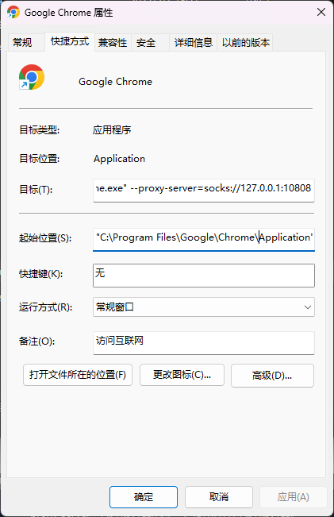

## windows Chrome 浏览器谷歌翻译，配置代理后还是翻译失败的问题解决方案

**原因: 打开浏览器后，第一次访问其他语言的网页时（即右上角提示翻译，但你还没有去点击翻译），浏览器就会访问一次 translate.googleapis.com，而这次访问是不受浏览器扩展控制的（直接走的系统网络配置）。也就是，浏览器监测到网页语言不一样时，就会去不受扩展控制的强制直连访问一次 translate.googleapis.com，后续在浏览器关闭之前就不会再这样做了，因此只要这一次强制直连访问成功，那么后续进行翻译都可以由扩展控制 走科技 或 被重定向了。**

* 具体原因参考[知乎问答](https://zhuanlan.zhihu.com/p/576932998)
* 解决方案1：系统网络配置为代理（代理软件设置为全局代理模式），如v2rayN上配置为"自动配置系统代理"即可
* 解决方案2（推荐）: chrome配置启动参数添加代理选项。**系统网络不必配置为代理（不需要设置代理软件设为全局代理模式）**
  
  具体步骤：

    1. 找到chrome的快捷方式：开始菜单搜索chrome 找到 Google Chrome应用, 
    2. 鼠标右击Google Chrome应用，在弹出的选中项选择打开文件位置，跳转到chrome的快捷方式目录。（如果你使用的快捷方式在其他目录，则更改对应目录的）
    3. 右键Google Chrome快捷方式 - 属性 - 快捷方式 选项卡 - 目标 输入框
    4. 在"..\chrome.exe" 后输入空格并添加代理命令 --proxy-server=socks://127.0.0.1:10808，注意需要在"..\chrome.exe" 冒号后面输入。以上为socks代理 http代理配置为 --proxy-server=http://127.0.0.1:10809，ip地址后端口号改成自己代理软件的。
    5. 点击应用 - 确定。设置成功，重新打开浏览器测试翻译效果

### 截图

## 许可
 本作品采用<a rel="license" href="http://creativecommons.org/licenses/by-sa/4.0/">知识共享署名-相同方式共享 4.0 国际许可协议</a>进行许可。